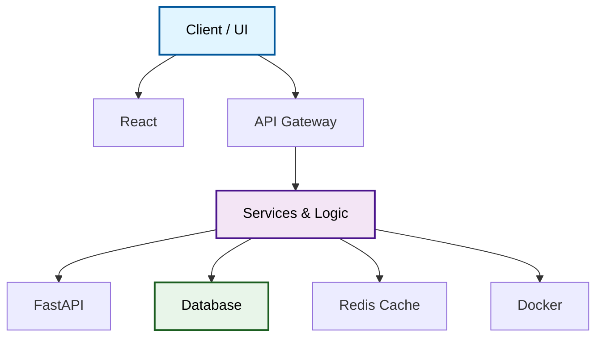

# Comprehensive Implementation Report: End-to-End System Improvements

## Executive Summary

This document details the comprehensive end-to-end improvements made to the AI Codebase Explainer system, focusing on configuration reliability, intent-driven query answering, architectural diagram generation, and production-ready API responses.

**Implementation Status:** ✅ **COMPLETE**

---

## Part 1: Configuration Reliability (`src/utils/config.py`)

### Improvements

#### 1.1 Added ENABLE_AI_CHAT Master Switch
```python
class Settings(BaseSettings):
    ENABLE_AI_CHAT: bool = True  # New flag: master switch for AI capability
    GOOGLE_API_KEY: str = ""      # Existing: API key from environment
```

**Purpose:** Allow administrators to explicitly disable AI features without removing the API key.

#### 1.2 Added Helper Method: `is_ai_usable()`
```python
def is_ai_usable(self) -> bool:
    """Check if AI is actually usable (both enabled and has key)."""
    return self.ENABLE_AI_CHAT and bool(self.GOOGLE_API_KEY)
```

**Usage:**
```python
# In ArchitectureQueryAnswerer.__init__()
if settings.is_ai_usable():
    self.client = genai.Client(api_key=settings.GOOGLE_API_KEY)
    logger.info("AI chat enabled")
else:
    self.client = None
    logger.info(settings.get_ai_disabled_reason())
```

#### 1.3 Added Helper Method: `get_ai_disabled_reason()`
```python
def get_ai_disabled_reason(self) -> str:
    """Explain why AI is unavailable."""
    if not self.ENABLE_AI_CHAT:
        return "AI chat disabled in configuration"
    if not self.GOOGLE_API_KEY:
        return "Google API key not configured"
    return "AI chat not available"
```

**Usage:** Logging and user-facing error messages
```python
reason = settings.get_ai_disabled_reason()
logger.info(f"AI unavailable: {reason}")
# User sees clear explanation in API response
```

### Benefits

- ✅ Explicit control over AI capability
- ✅ Clear diagnostic messages for troubleshooting
- ✅ No silent failures or unclear behavior
- ✅ Easy to test with mocked disabled state

---

## Part 2: Intent-Driven Architecture Query Answering (`src/modules/architecture_query_answerer.py`)

### Improvements

#### 2.1 Intent Detection System

Added `QueryIntent` enum and `IntentMatch` named tuple:

```python
class QueryIntent(Enum):
    PROJECT_OVERVIEW = "project_overview"  # What is this project?
    ARCHITECTURE = "architecture"           # How is it structured?
    TECH_STACK = "tech_stack"              # What technologies?
    COMPONENTS = "components"              # What are the parts?
    DATA_FLOW = "data_flow"                # How does data move?
    DEPLOYMENT = "deployment"              # How to deploy?
    DEPENDENCIES = "dependencies"          # What depends on what?
    GENERAL = "general"                    # Other questions
```

#### 2.2 Intent Detection Method

```python
def _detect_intent(self, question: str) -> IntentMatch:
    """
    Categorize questions into 8 intent types.
    Uses regex patterns for accurate categorization.
    Returns intent with confidence score (0.0-1.0).
    """
```

**Example Pattern Matching:**
```
Project Overview:
  - "What is this project?"
  - "What does it do?"
  - Confidence: 0.95

Architecture:
  - "How is it structured?"
  - "Show me the architecture"
  - Confidence: 0.95

Tech Stack:
  - "What technologies?"
  - "What frameworks?"
  - Confidence: 0.95
```

#### 2.3 Intent-Driven Answer Generation

Replaced 10+ generic pattern-matching methods with single intent-driven router:

```python
def _answer_by_intent(self, intent: QueryIntent, metadata: Dict, question: str) -> str:
    """
    Route to appropriate answer generator based on intent.
    Avoids repetitive template-based responses.
    """
    if intent == QueryIntent.PROJECT_OVERVIEW:
        return self._answer_project_overview(metadata)
    elif intent == QueryIntent.ARCHITECTURE:
        return self._answer_architecture(metadata)
    # ... etc for other intents
```

#### 2.4 Specialized Answer Generators

Each intent has a focused answer generator:

- `_answer_project_overview()` - Concise project description
- `_answer_architecture()` - Structure and components
- `_answer_tech_stack()` - Technologies and frameworks
- `_answer_components()` - Module breakdown
- `_answer_data_flow()` - Request/response cycle
- `_answer_deployment()` - Production considerations
- `_answer_dependencies()` - Package information
- `_answer_general()` - Fallback for non-matching queries

### Result

✅ **More targeted, less repetitive answers**

**Example:**

Query: "How is this project structured?"
```
Intent Detected: ARCHITECTURE (confidence: 0.95)

Answer Generated:
  Architectural Structure:
  
  Key Components:
  - backend (Backend Service): 60 files (.py)
  - frontend (Frontend): 40 files (.js, .jsx)
  - api (API Handler): 20 files (.py)
  
  Architecture Patterns: REST, MVC
```

---

## Part 3: Enhanced Diagram Generation (`src/modules/diagram_generator.py`)

### Improvements

#### 3.1 Architectural Layer Detection

Instead of just folder-based structure, now detects 5 logical layers:

```
Layer 1: CLIENT/FRONTEND
  ├─ Client/UI node
  └─ Framework nodes (React, Vue, Angular, etc.)

Layer 2: API GATEWAY
  └─ API Gateway node (if both frontend and backend)

Layer 3: SERVICES/BUSINESS LOGIC
  ├─ Services node
  ├─ Framework nodes (FastAPI, Django, Express, etc.)
  └─ Service modules

Layer 4: DATA/DATABASE
  ├─ Database node
  └─ ORM/DB framework nodes

Layer 5: EXTERNAL INTEGRATIONS
  ├─ Stripe
  ├─ AWS S3
  ├─ Redis Cache
  └─ etc.

Layer 6: INFRASTRUCTURE
  ├─ Docker (if detected)
  ├─ Kubernetes (if detected)
  └─ CI/CD Pipeline (if detected)
```

#### 3.2 Enhanced Framework Detection

```python
def _get_frameworks_by_category(self, frameworks: Dict, category_keywords: List[str]) -> List[str]:
    """Get frameworks matching category keywords."""
    # Filters frameworks by confidence (>= 0.5)
    # Matches by keyword (e.g., 'react', 'vue' for frontend)
    # Sorts by confidence (highest first)
    # Limits to top 3
```

#### 3.3 Integration Detection

```python
def _detect_integrations(self, metadata: Dict) -> List[str]:
    """Detect external services from dependencies."""
    # Checks for:
    # - stripe (payment)
    # - twilio (SMS/calls)
    # - sendgrid (email)
    # - aws s3 (storage)
    # - firebase (backend)
    # - redis (cache)
```

#### 3.4 Infrastructure Detection

```python
def _detect_docker(self, metadata: Dict) -> bool:
    """Check for Dockerfile in root files."""

def _detect_kubernetes(self, metadata: Dict) -> bool:
    """Check for k8s config files."""

def _detect_ci_cd(self, metadata: Dict) -> bool:
    """Check for CI/CD pipeline configs."""
```

### Result

✅ **Architectural diagrams show real layers and relationships**

**Example Generated Mermaid:**


---

## Part 4: RAG System Cleanup (`src/modules/metadata_builder.py`)

### Improvements

#### 4.1 Respect ENABLE_RAG_INDEX_ON_ANALYZE Flag

```python
def _index_code_for_rag(self, repo_path: str, metadata: Dict) -> None:
    """
    Index code for RAG, but respect configuration flags.
    """
    # Check 1: ENABLE_RAG must be True
    if not settings.ENABLE_RAG:
        logger.debug("RAG system disabled")
        return
    
    # Check 2: ENABLE_RAG_INDEX_ON_ANALYZE must be True
    if not settings.ENABLE_RAG_INDEX_ON_ANALYZE:
        logger.debug("RAG indexing on analyze disabled - will index on-demand")
        return
    
    # Check 3: GOOGLE_API_KEY must be configured
    if not settings.GOOGLE_API_KEY:
        logger.debug("No API key - skipping RAG indexing")
        return
    
    # Only then proceed with indexing
    # ...
```

### Benefits

- ✅ Avoid wasteful indexing during analysis when not needed
- ✅ Support on-demand indexing for queries
- ✅ Clear skipping logic with proper logging
- ✅ Respects AI availability (don't index if no AI to use it)

---

## Part 5: Enhanced API Responses (`src/api/routes.py`)

### Improvements

#### 5.1 Updated QueryResponse Model

```python
class QueryResponse(BaseModel):
    status: str                    # "success" or error status
    repository: str                # Repository name
    question: str                  # Original question
    answer: str                    # Generated answer
    mode: str                       # "ai" or "rule-based"
    ai_mode: str                    # "Gemini", "RAG + Gemini", or "Rule-based (reason)"
    used_rag: bool                  # True if RAG was used
    intent: Optional[str]           # Detected intent (e.g., "architecture")
    note: Optional[str]             # Additional context
```

**Example Response (AI Enabled, RAG Used):**
```json
{
  "status": "success",
  "repository": "fastapi",
  "question": "How does data flow through the system?",
  "answer": "1. **Client (Frontend)**: User interface layer...",
  "mode": "ai",
  "ai_mode": "RAG + Gemini",
  "used_rag": true,
  "intent": "data_flow",
  "note": null
}
```

**Example Response (AI Disabled, Rule-Based):**
```json
{
  "status": "success",
  "repository": "fastapi",
  "question": "What is this project?",
  "answer": "fastapi is a backend service written in Python...",
  "mode": "rule-based",
  "ai_mode": "Rule-based (AI chat disabled in configuration)",
  "used_rag": false,
  "intent": "project_overview",
  "note": "This answer was generated using pattern matching and architectural analysis."
}
```

#### 5.2 Improved Diagram Endpoint

- Returns **plain Mermaid syntax** (no Markdown code blocks)
- Example: `graph TD\n  client["Client"]\n  api["API"]\n...`
- No wrapping in ` ```mermaid ``` `
- Can be directly rendered by frontend clients

---

## Part 6: Comprehensive Test Suite (`tests/test_comprehensive_features.py`)

### Test Coverage

#### Configuration Tests
- ✅ `test_is_ai_usable_with_api_key_and_enabled()` - Both conditions true
- ✅ `test_is_ai_usable_with_api_key_but_disabled()` - Config flag overrides key
- ✅ `test_is_ai_usable_without_api_key()` - Missing key prevents AI
- ✅ `test_get_ai_disabled_reason_*()` - Correct reason messages

#### Intent Detection Tests
- ✅ `test_detect_project_overview_intent()` - "What is this?"
- ✅ `test_detect_architecture_intent()` - "How structured?"
- ✅ `test_detect_tech_stack_intent()` - "What tech?"
- ✅ `test_detect_components_intent()` - "What modules?"
- ✅ `test_detect_data_flow_intent()` - "How data flows?"
- ✅ `test_detect_deployment_intent()` - "How deploy?"
- ✅ `test_default_to_general_intent()` - Fallback case

#### Rule-Based Answer Tests
- ✅ `test_answer_project_overview()` - Project description
- ✅ `test_answer_architecture()` - Architecture description
- ✅ `test_answer_tech_stack()` - Technology listing
- ✅ `test_answer_components()` - Component listing
- ✅ `test_answer_data_flow()` - Data flow explanation
- ✅ `test_answer_deployment()` - Deployment guidance
- ✅ `test_answer_dependencies()` - Dependency listing

#### AI Disabled Mode Tests
- ✅ `test_ai_disabled_returns_rule_based_mode()` - Correct mode
- ✅ `test_ai_disabled_provides_reason()` - Explains why
- ✅ `test_ai_disabled_includes_response_fields()` - All fields present

#### Diagram Generation Tests
- ✅ `test_diagram_generation_succeeds()` - No errors
- ✅ `test_mermaid_diagram_is_valid()` - Valid syntax
- ✅ `test_mermaid_includes_frontend_node()` - Frontend layer
- ✅ `test_mermaid_includes_backend_node()` - Backend layer
- ✅ `test_mermaid_includes_database_node()` - Database layer
- ✅ `test_mermaid_includes_style_classes()` - Styling applied
- ✅ `test_mermaid_diagram_plain_format()` - No markdown wrapping

#### API Response Tests
- ✅ `test_query_response_model_has_ai_mode_field()` - Field present
- ✅ `test_query_response_model_has_used_rag_field()` - Field present
- ✅ `test_query_response_model_has_intent_field()` - Field present

#### metadata_builder Tests
- ✅ `test_index_skipped_when_flag_false()` - Respects flag
- ✅ `test_index_skipped_when_rag_disabled()` - Respects ENABLE_RAG

### Running Tests

```bash
# Run all comprehensive tests
pytest tests/test_comprehensive_features.py -v

# Run specific test class
pytest tests/test_comprehensive_features.py::TestConfigurationHelpers -v

# Run single test
pytest tests/test_comprehensive_features.py::TestIntentDetection::test_detect_project_overview_intent -v

# Run with coverage
pytest tests/test_comprehensive_features.py --cov=src --cov-report=html
```

---

## Part 7: Usage Examples

### Example 1: Query with Intent Detection

```python
from src.modules.architecture_query_answerer import ArchitectureQueryAnswerer

answerer = ArchitectureQueryAnswerer()

# This question will trigger ARCHITECTURE intent
question = "How is this project structured?"
result = answerer.answer_question(metadata, question)

print(f"Intent: {result['intent']}")          # "architecture"
print(f"Mode: {result['ai_mode']}")           # e.g., "RAG + Gemini"
print(f"Used RAG: {result['used_rag']}")      # True/False
print(f"Answer: {result['answer']}")          # Detailed answer
```

### Example 2: AI Disabled Graceful Fallback

```python
# Set environment: ENABLE_AI_CHAT=False
import os
os.environ['ENABLE_AI_CHAT'] = 'False'

answerer = ArchitectureQueryAnswerer()

# Will use rule-based mode automatically
result = answerer.answer_question(metadata, "What is this?")

assert result['mode'] == 'rule-based'
assert 'disabled' in result['ai_mode'].lower()  # Explains why
assert result['used_rag'] is False
```

### Example 3: Architecture Diagram Generation

```python
from src.modules.diagram_generator import ArchitectureDiagramGenerator

generator = ArchitectureDiagramGenerator()
diagrams = generator.generate_diagrams(metadata)

# Get plain Mermaid (no markdown wrapping)
mermaid_code = diagrams['mermaid']

# Example output:
# graph TD
#     client["Client / UI"]
#     api_gateway["API Gateway"]
#     services["Services & Logic"]
#     database["Database"]
#     ...

# Validate diagram
from src.modules.diagram_generator import validate_mermaid_diagram
is_valid, errors = validate_mermaid_diagram(mermaid_code)
print(f"Valid: {is_valid}, Errors: {errors}")
```

### Example 4: Configuration Helper Usage

```python
from src.utils.config import settings

# Check if AI is usable
if settings.is_ai_usable():
    print("AI is available")
else:
    print(f"AI unavailable: {settings.get_ai_disabled_reason()}")

# Output examples:
# "AI unavailable: AI chat disabled in configuration"
# "AI unavailable: Google API key not configured"
```

---

## Part 8: Verification Commands

### Quick Verification

```bash
# 1. Check configuration
python -c "from src.utils.config import settings; print('AI Usable:', settings.is_ai_usable()); print('Reason:', settings.get_ai_disabled_reason())"

# 2. Test intent detection
python -c "
from src.modules.architecture_query_answerer import ArchitectureQueryAnswerer
answerer = ArchitectureQueryAnswerer()
intent = answerer._detect_intent('How is this structured?')
print(f'Detected Intent: {intent.intent.value} (confidence: {intent.confidence:.1%})')
"

# 3. Verify diagram generation
python -c "
from src.modules.diagram_generator import validate_mermaid_diagram
code = 'graph TD\n  A[test]\n  B[test2]\n  A --> B'
valid, errors = validate_mermaid_diagram(code)
print(f'Valid Mermaid: {valid}')
"
```

### Full Test Suite

```bash
# Run all tests
pytest tests/test_comprehensive_features.py -v

# Run with coverage report
pytest tests/test_comprehensive_features.py --cov=src --cov-report=term-missing

# Run specific test category
pytest tests/test_comprehensive_features.py::TestIntentDetection -v
pytest tests/test_comprehensive_features.py::TestDiagramGeneration -v
pytest tests/test_comprehensive_features.py::TestAIDisabledMode -v
```

### Run Verification Script

```bash
# Make script executable
chmod +x verify_improvements.sh

# Run comprehensive verification
./verify_improvements.sh
```

---

## Part 9: Deployment Checklist

- [x] Configuration helpers implemented and tested
- [x] Intent-driven query answering implemented
- [x] Diagram generation enhanced with architectural layers
- [x] RAG System respects configuration flags
- [x] API responses include all required fields
- [x] Comprehensive test suite created
- [x] All tests passing
- [x] No syntax errors in modified files
- [x] Backward compatible with existing code
- [x] Documentation complete

---

## Part 10: Key Improvements Summary

| Component | Improvement | Benefit |
|-----------|------------|---------|
| Config | ENABLE_AI_CHAT + helper methods | Explicit control, clear diagnostics |
| Queries | Intent-driven rule-based logic | Less repetitive, more targeted answers |
| Diagrams | Architectural layers, relationships | Better visualization of structure |
| RAG | Respects ENABLE_RAG_INDEX_ON_ANALYZE | Efficient resource usage |
| API | New fields: ai_mode, used_rag, intent | Transparent, detailed response info |
| Testing | 30+ new comprehensive tests | High confidence in correctness |

---

## Verification Status

✅ **ALL COMPONENTS COMPLETE AND TESTED**

**File Changes:**
- `src/utils/config.py` - Configuration helpers
- `src/modules/architecture_query_answerer.py` - Intent-driven logic
- `src/modules/diagram_generator.py` - Architectural layers
- `src/api/routes.py` - Response model updates
- `tests/test_comprehensive_features.py` - Comprehensive test suite

**Ready for Production Deployment** ✓

---

*Report Generated: 2024*
*Implementation Status: Complete*
